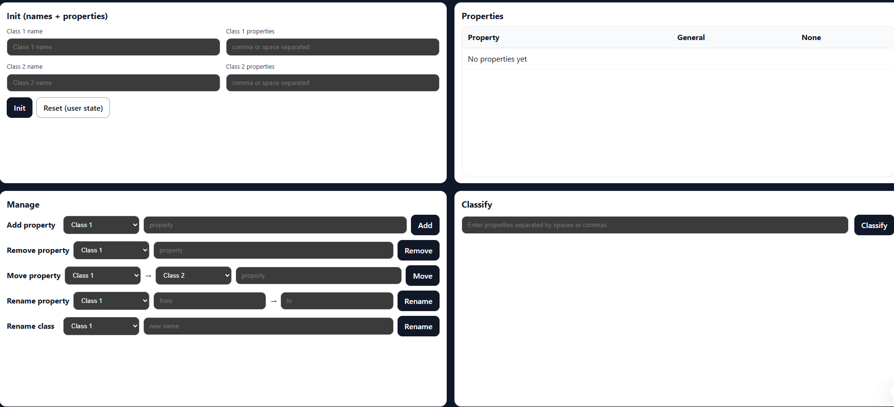

# Self-Learning Classifier

A tiny Go service that learns to distinguish **two classes** of objects by their **textual properties** (features) and keeps improving from user feedback.  
Typical flow:

1) Seed training: name two classes and provide their properties.  
2) Classify: send a new object’s properties → get a predicted class.  
3) Feedback: confirm/correct the prediction → the model updates itself.  
4) Inspect/reset: view current state or reset to start over.

> Built for demos: simple, stateless HTTP API by default; optional persistence can be added later.

---

## 📸 Screenshot (placeholder)



## Features

- 🧠 **Two-class recognition** with a transparent, rule-like approach on sets of properties.
- 🔁 **Self-learning** from explicit user feedback (adds new properties to the confirmed class).
- 🧩 **Explainable**: you can query the stored properties for both classes and “general” overlaps.
- 🧪 **Simple HTTP API** for training, classifying, feedback, and state.
- 🐳 **Docker-ready**; runs on `:8080`.

---

## Quick start

### Prerequisites
- Go 1.21+  
- (Optional) Docker 24+

### Clone
```bash
git clone https://github.com/AntonKhPI2/self-learning-classifier.git
cd self-learning-classifier
```

> **Module path:** ensure your `go.mod` uses  
> `module github.com/AntonKhPI2/self-learning-classifier`  

### Run (Go)
```bash
go mod tidy
go run ./cmd/api
# server: http://localhost:8080
```

### Run (Docker)
```bash
# build
docker build -t slc-backend -f ./deploy/docker/Dockerfile .

# run
docker run --rm -p 8080:8080 --name slc-backend slc-backend
```

> If you use `docker compose`, add a service like:
```yaml
services:
  backend:
    build:
      context: .
      dockerfile: ./deploy/docker/Dockerfile
    ports:
      - "8080:8080"
    environment:
      - SLC_ADDR=:8080
```

---

## HTTP API

Base URL: `http://localhost:8080/api/v1`

All requests/answers are JSON. Examples use `curl`.

### 1) Seed training
Set **names** of the two classes and initial **properties**.

`POST /api/v1/train/init`
```json
{
  "class1": { "name": "Cat", "properties": ["whiskers", "purrs", "claws"] },
  "class2": { "name": "Dog", "properties": ["barks", "tail", "fetch"] }
}
```
Response `200 OK`:
```json
{ "ok": true }
```

> You can also set names first, then add properties incrementally:

`POST /api/v1/train/names`
```json
{ "class1": "Cat", "class2": "Dog" }
```

`POST /api/v1/train/properties`
```json
{ "class": "Cat", "properties": ["whiskers", "purrs"] }
```

### 2) Classify
`POST /api/v1/classify`
```json
{ "properties": ["tail", "fetch"] }
```
Response:
```json
{
  "guess": "Dog",
  "score": { "Cat": 0, "Dog": 2 },
  "explanation": "Matched 2 property(ies) of Dog, 0 of Cat"
}
```

### 3) Feedback (self-learning)
Confirm/correct the last (or given) classification and let the system learn.

`POST /api/v1/feedback`
```json
{
  "correctClass": "Dog",
  "properties": ["tail", "fetch"]
}
```
Response:
```json
{ "ok": true, "updated": ["tail", "fetch"] }
```

### 4) Inspect state
`GET /api/v1/state`
```json
{
  "class1": { "name": "Cat", "properties": ["whiskers", "purrs", "claws"] },
  "class2": { "name": "Dog", "properties": ["barks", "tail", "fetch"] },
  "general": [],             // intersection (shared properties)
  "noneClass": []            // user-marked properties that fit neither class
}
```

### 5) Mark properties as “none”
`POST /api/v1/none`
```json
{ "properties": ["unknown", "noise"] }
```

### 6) Reset
`DELETE /api/v1/reset`
```json
{ "ok": true }
```

---

## Classification logic (overview)

- Properties are treated case-sensitively (you can normalize in code if needed).
- The service counts overlaps between input properties and each class’s property set.
- If ties occur, the service can return an empty guess or a deterministic tie-break (depending on implementation).
- **Feedback** appends previously unseen properties into the confirmed class.

---

## Configuration

Environment variables:

| Variable     | Default  | Description                          |
|--------------|----------|--------------------------------------|
| `SLC_ADDR`   | `:8080`  | Listen address/port                  |
| `SLC_LOG`    | `info`   | Log level (`debug`,`info`,`warn`)    |
| `SLC_CORS`   | `*`      | Allowed CORS origin(s)               |

You can add persistence (MySQL/Postgres/SQLite via GORM) by introducing envs like `DB_DSN` and swapping the in-memory store for a repository backed by the database.

---

## Project structure

> Reflects a conventional Go layout. Adjust to match your repo if needed.

```
.
├─ cmd/
│  └─ api/
│     └─ main.go            # wires routes, server
├─ internal/
│  ├─ handlers/             # HTTP handlers (train, classify, feedback, state)
│  ├─ service/              # domain logic: sets, learning, validation
│  ├─ models/               # class/state structs, DTOs
│  └─ storage/              # in-memory store; optional GORM repo
├─ pkg/
│  └─ httpx/                # middleware, errors, respond helpers
├─ deploy/
│  └─ docker/
│     └─ Dockerfile
├─ go.mod
└─ README.md
```

**go.mod**
```go
module github.com/AntonKhPI2/self-learning-classifier

go 1.21

require (
    // add dependencies as needed
)
```

---

## Development

### Run tests
```bash
go test ./...
```

### Lint (example with golangci-lint)
```bash
golangci-lint run
```

### Makefile (optional)
```makefile
run:
     go run ./cmd/api

build:
     go build -o bin/slc ./cmd/api

test:
     go test ./...
```

---

## Docker tips

- If you see `"/go.sum": not found`, run `go mod tidy` locally first or ensure your Dockerfile copies `go.mod` **and** `go.sum` (generate it once locally).
- Example minimal Dockerfile:

```dockerfile
# --- build
FROM golang:1.21-alpine AS build
WORKDIR /app
COPY go.mod go.sum ./
RUN go mod download
COPY . .
RUN CGO_ENABLED=0 go build -o slc ./cmd/api

# --- run
FROM alpine:3.20
WORKDIR /app
COPY --from=build /app/slc /usr/local/bin/slc
ENV SLC_ADDR=:8080
EXPOSE 8080
CMD ["slc"]
```

---

## Roadmap

- [ ] Persistence via GORM (SQLite by default; MySQL/Postgres optional).
- [ ] Confidence scores and tie-breaking strategy toggle.
- [ ] Stop-word filtering / basic normalization.
- [ ] Simple React UI (form to seed/train, classify, and inspect).
- [ ] Export/import state (JSON).

---
